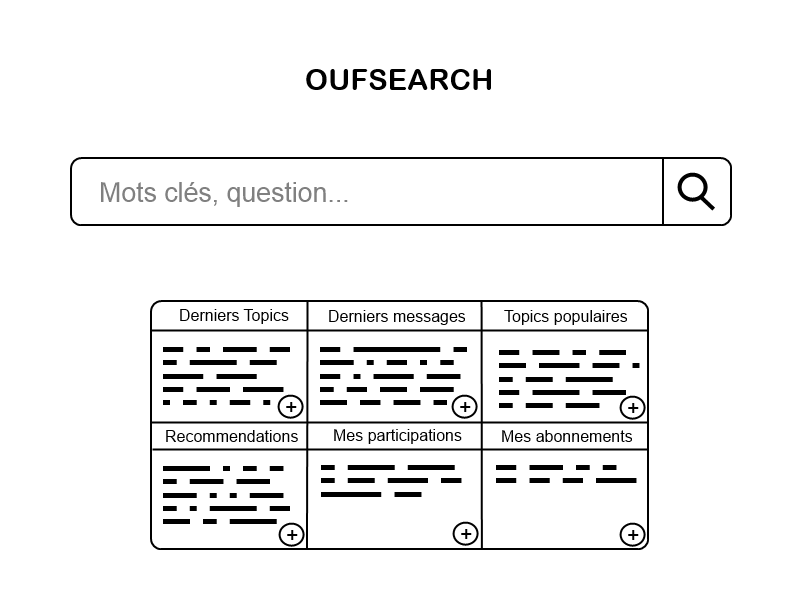

# Projet Interaction Homme-Machine : Forum Oufsearch
## Fonctionnalités utiles et importantes
1. Poser une question
2. Lire les sujets et les messages des utilisateurs
3. Créer un nouveau sujet de discussion
4. Répondre à un sujet ou une question
5. Voter positivement ou négativement à une réponse
6. Accéder aux derniers sujets créés, aux sujets populaires et aux sujets auxquels l'utilisateur a répondu.
7. Signaler un message inapproprié
8. Suivre un sujet
9. Partager un message spécifique par une URL directe

## Scénarios d'utilisation

### Scénario 1

Le forum repose sur un algorithme performant de recherche. Par rapport aux autres forums banals utilisant un système de catégorie qui nécessite une recherche fastidieuse de l’utilisateur au sein des catégories.
Un adolescent en recherche de réponses et qui souhaite participer à l’échange arrive sur oufsearch.com. La ressemblance forte avec la page d'accueil de Google permet à l’utilisateur de se repérer aisément. Il exprime ses intérêts dans une barre de recherche et un algorithme performant retourne les réponses dans un ordre préférentiel (pertinence décroissante).
Il accède à un topic et ses réponses, classées par ordre chronologique et distinguées à l’aide d’un code couleur en fonction de leur popularité. L’utilisateur veut faire part de ses expériences, il peut donc répondre à un sujet sans soucis d’inscription. Il peut compléter ses réponse à l'aide d'images et de liens. Si ce sujet l’intéresse particulièrement, il peut suivre ("follow") ce sujet.
Toutefois, si aucun sujet ne satisfait ses attentes, il a la possibilité d’en créer un. Celui-ci nécessite un sujet et un premier message.
Si l’utilisateur souhaite avoir un aperçu global de l’activité du forum, la page d’accueil est un hub qui regroupe :
- les derniers topics
- les dernière réponses
- les topics populaires
- les recommandations
- les topics auxquels il a participé
- les topics qu’il a suivi

### Scénario 2

Un utilisateur se pose une question sur un sujet donné. Il souhaite avoir les avis des internautes sur ce sujet, et pouvoir partager les réponses en envoyant un lien direct à ses amis. En posant sa question dans la barre de recherche, il peut voir les sujets se rapprochant le plus de sa question. Dans le cas où les réponses ouvrent un débat, il aimerait pouvoir y participer en ajoutant un ou plusieurs messages à la suite du sujet. Plus tard dans la journée, en retournant sur l'accueil du site, il pourra retrouver un lien vers le sujet qu'il a visité.

### Scénario 3

Oufman, le plus ouf des superhéros, se pose une question très personnelle qui nuirait à sa réputation de ouf si elle venait à être ébruitée. Il souhaiterait pouvoir poser cette question de façon anonyme et obtenir des avis neutres d'internautes sans qu'il soient influencés par sa réputation de superhéros de ouf. Plus tard, après avoir reçu une réponse de ouf, il aimerait la mettre en valeur pour aider les internautes qui se poseraient aussi cette même question. Il pourrait donc donner un "+" à la réponse de ouf, et des "-" aux réponses pas trop oufs.

### Scénario 4

Jean Kevin voudrait ressembler aux jeunes de son âge et participer activement sur Internet aux sujets populaires du moment. En arrivant sur **Forum Search de Ouf**, il voudrait accéder directement aux sujets les plus actifs du moment.

## Remarques

- Page d'accueil, remplacer le "+" par une "flèche vers le bas"
- Garder la top réponse en haut
- filtres de temps et de ouftags sur la liste des sujets
- filtres de votes et meilleur réponse sur page topic
- page d'accueil : ajouter ouftags populaires
- pagination en haut et en bas (liste topics)
- système +/- de couleurs plus pâle
- Taille des blocs de l'accueil plus grosse
- Rajouter "Mes Sujets" dans blocs accueil
