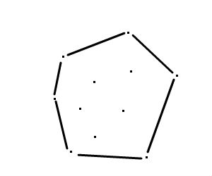
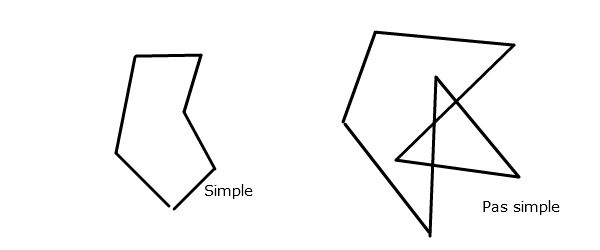
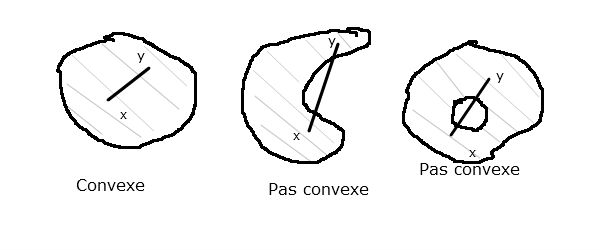
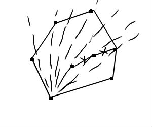

# Algorithmique géométrique
## Chapitre 1
(voir cours)
## Chapitre 2 Calcul d'enveloppes convexes

Problème dans R² :



### Définitions
- Un polygone est une suite de segments S<sub>1</sub>=[p<sub>1</sub>q<sub>1</sub>]... avec q<sub>i</sub>sub> = p<sub>i+1</sub>sub>, n=1 et q<sub>n</sub>sub> = p<sub>1</sub>sub>
	- 
- Un polygone (S<sub>1</sub>sub> = [p<sub>1</sub>sub>q<sub>1</sub>sub>] ...) est ***simple*** si :
	- S<sub>i</sub>sub> U S<sub>j</sub> &ne; ∅ => j=i+1 et le seul point d'intersection de S<sub>i</sub> et S<sub>j</sub> est q<sub>i</sub> = p<sub>j</sub>

**Propriété** : Un polygone simple détermine 2 régions du plan :

- une qui est bornée : l'***intérieur*** du polygone
- l'autre qui n'est pas bornée : l'***extérieur*** du polygone

**Def  :** Un ensemble X⊂R<sup>2</sup> est ***convexe*** si pourtoutx,y&isin;X, le segment [x,y] est inclus dans X.

**Ex:** 

**Def :** Un ***polygone convexe*** est un polygone simple dont l'intérieur est convexe.

**Prop :**

- Un polygone convexe est une intersection bornée de demi-plan
- L'intersection (finie) de (l'intérieur de) polygones convexes est (l'intérieur d')un polygone convexe

**Def :** Soit P={p<sub>1</sub>... p<sub>n</sub>} un ensemble de n points du plan. L'**enveloppe connexe de P**, notée EC(P) est le plus petit polygone connexe contenant tous les points de P.
C'est ausi l'intersection de tous les polygones convexes contenant P

**But:** Calculer EP(P) ?
**Algo naïf**

```
pour tout couple (p,q)&isin;P
	marquer (p,q) à VRAI
	pour tout R&isin;P\{p,q}
		si R est à gauche de la droite (p,q) orientée de p vers q
		marquer (p,q) à FAUX
Retourner les segments [p,q] avec (p,q) marqué à VRAI
```

Algo en O(n<sup>3</sup>). *On va voir mieux...*

### Algo de Jarvis
"technique du paquet cadeau..."



**Principe :** On calcule P<sub>min</sub> le point d'ordonnée min, puis P<sub>suivant</sub> le point le "plus à droite de P<sub>min</sub>" et on continue...

**Algo :** -> voir fiche d'algos

Comment choisir P<sub>suivant</sub> le plus à droite de [P<sub>courant</sub> P]:
```
Pour i=1 à n
	Si det (Pcourant P, Pcourant Pi)<0
		P <- Pi;
Psuivant <- P;
```
**Complexité :** O(n.|EC(P)|) = O(n<sup>2</sup>)

###Algo de Graham (1972)
Marche en O(nlog n)

**Principe :** On trie P par ordre polaire autour de P<sub>min</sub> (cf TD). On les sélectionne dans cet ordre là tant qu'on "trouve à gauche" par rapport au dernier segment sélectionné (formé par le dernier couple de points sélectionnés).

**Complexité :**
- Tri par odre polaire -> O(nlogn)
- Naïvement la boucle ligne 5 se fait en O(n<sup>2</sup>).
- Plus finement, à l'étape i, on dépile des sommets Q<sub>j</sub> avec j &lsaquo; i et les ré-empilera donc jamais. En tout, dans la boucle l.5 on fera au pire n fois "Déplacer" et "Empiler". Cette boucle se fait en tout en O(n).
Graham se fait en O(n.log n).

###Pour conclure

- On verra en TD que Ω(n.log n) est une borne infinie pour le calcul de l'EC.
- Jarvis s'améliore en O(n.log |EC(P)|)
- Algo de maintien dynamique d'enveloppe convexe en O(log<sup>2</sup>n) pour l'ajout ou la suppression d'un sommet
- En dimension d, algo de calcul de l'EC en O(n<sup>[d/2]+1</sup>).
- En dimension 3, il existe un algoo en O(n.log n)
